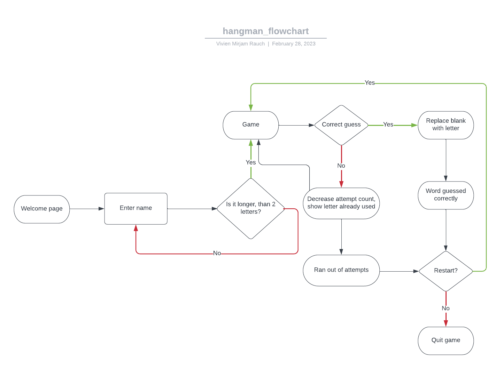

# __Hangman Game - Python Essentials Portfolio Project__

Welcome to my recreation of the classic Hangman game.
The game is built with Python and deployed in a mock terminal which was built by Code Institute.

## Live Site

## Repository

# Table of Contents

- [UX Design](#ux-design)
    * [Objective](#objective---stragety-plane)
        * [User Stories](#user-stories)
    * [Features](#features---scope-skeleton--structure-plane)
        * [Flowchart](#flowchart)
        * [Existing Features](#existing-features)
        * [Future Features](#future-features)
- [Testing](#testing)
    * [Accessibility & Performance](#accessibility--performance)
    * [Validator Testing](#validator-testing)
        * [Python](#python)
* [Bugs](#bugs)
    * [Fixed Bugs](#fixed-bugs)
    * [Unfixed Bugs](#unfixed-bugs)
* [Development](#development)
* [Technologies Used](#technologies-used)
* [Deployment](#deployment---surface-plane)
* [Credits](#credits)

# UX Design

## **Objective** - *Stragety Plane*

My objective was to recreate a retro feel to this game while maintaining clarity and intuitive navigation.

### **User Stories**

As a user, I:
- want to be given some guidelines regarding the game, like:
    - what kind of words I'm gonna guess - in my opinion, the focused guessing on one topic
      facilitates success and encourages a deeper dive into that particular topic
    - how many attempts do I have
- want to be visually aided and entertained as well, especially given the neutrality of the game    
  platform
- want to be reminded of the letters I already guessed
- want to be reminded of the number of attempts I have left
- want to see a clear layout of the game where I intuitively know what to do and what presents what 
  kind of information
- want to be stopped when I enter something I shouldn't be entering
- want to have the option to play again or exit the game once the round is over

## **Features** - *Scope, skeleton & structure plane*

### Flowchart

Creating a flowchart in the beginning of the project helped me lay out the structure of the game, the logic of it and the functionality I'd like to implement in it.

### Welcome Page

This is the first think the user gets to see when the game first runs.
