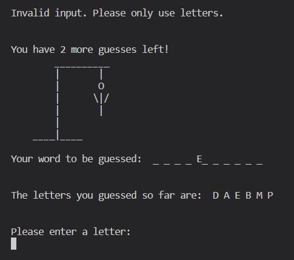

# __Hangman Game - Python Essentials Portfolio Project__

Welcome to my recreation of the classic Hangman game.
The game is built with Python and deployed in a mock terminal which was built by Code Institute.

## Live Site

## Repository

# Table of Contents

- [UX Design](#ux-design)
    * [Objective](#objective)
        * [User Stories](#user-stories)
    * [Features](#features)
        * [Flowchart](#flowchart)
        * [Existing Features](#existing-features)
        * [Future Features](#future-features)
- [Testing](#testing)
* [Bugs](#bugs)
    * [Fixed Bugs](#fixed-bugs)
    * [Unfixed Bugs](#unfixed-bugs)
* [Technologies Used](#technologies-used)
* [Deployment](#deployment)
* [Development](#development)
* [Credits](#credits)

# UX Design

## **Objective**

My objective was to recreate a retro feel to this game while maintaining clarity and intuitive navigation.

### **User Stories**

As a user, I:
- want to be given some guidelines regarding the game, like:
    - what kind of words I'm gonna guess - in my opinion, the focused guessing on one topic
      facilitates success and encourages a deeper dive into that particular topic
    - how many attempts do I have
- want to be visually aided and entertained as well, especially given the neutrality of the game    
  platform
- want to be reminded of the letters I already guessed
- want to be reminded of the number of attempts I have left
- want to see a clear layout of the game where I intuitively know what to do and what presents what 
  kind of information
- want to be stopped when I enter something I shouldn't be entering
- want to have the option to play again or exit the game once the round is over

## **Features**

### **Flowchart**

Creating a flowchart in the beginning of the project helped me lay out the structure of the game, the logic of it and the functionality I'd like to implement in it.

### **Existing Features**

#### **Welcome Page**

This is the page the user gets to see when the game first runs.
It contains a little ascii text art that creates a retro game vibe.
The user gets introduced to the rules and also gets prompted to enter a username.
Once they entered one which only contains letters and is at least 3 letter long, they get to press
enter and start the game.

#### **The Game**

This page comes with:
- the visual of the hangman starting stage
- the number of attempts the user has
- underscores as placeholders for the word that will be replaced with the correctly guessed letters
- a line indicating where the used letters will be stored
- and the line where the user needs to enter their input

If the user enters a letter that's not in the word, they will be informed on the top of the game, their attempts will be reduced and shown, as well as the hangman progressing in its stages.

The user also gets to see which letter it was and then it gets stored in the used letter section

When the user enters a letter that has already been used, they get informed on the top.

When the user enters more than one character at a time, an error message will be raised.

If the user enters a character that is not a letter, an error message will be raised for that, too.

When the user guesses a letter correctly, the letter will replace the underscore and the letter will be stored in the already used letters as well.

If the user guesses the word correctly before running out of attempts, they win. They will be congratulated and offered to start a new game.

If the user rans out of attempts before they could guess the full word, they lose the game. They will be offered to start a new one as well.

When they choose to play again, they will get back to the start of the game and get a new word.
If they choose not to play, they will be thanked for playing and the program will exit.

If they enter something other than 'y' (yes) or 'n' (no), then an error will be raised.

### **Future Features**

In the future I'd like to implement the possibility to guess expressions and not just single words.

# __Testing__

The testing came back with errors regarding the ASCII arts that I used: *invalid escape sequence*, *line too long* and *whitespace* issues.
I went in the code and corrected the issues that didn't mess up the output of the ASCII art, but there are some that remained.
Other than that, I got a few long lines.

# __Bugs__

## __Fixed Bugs__

When I first wrote the code for the game function the game looped through all the stages after pressing one letter. There was no one solution for it, but to rewrite the code and divide it into even smaller pieces than before, which facilitated my own understanding of the logic of my code and the outcomes of my commands.

## __Unfixed Bugs__

I'm not aware of any bugs that interfere with the program at the moment.

# **Technologies Used**

  - Python
  - [Heroku](https://heroku.com) - for deployment
  - [LucidApp](https://lucid.app/users/login#/login) - for creating the flowchart
  - [ASCII Art Generator](https://patorjk.com/software/taag/#p=display&f=Graffiti&t=Type%20Something%20)
    and [ASCII Art](https://asciiart.website/index.php?art=holiday/4th%20of%20july) - for the retro game graphics ('Ivrit' style used) and the fireworks graphics.

# **Deployment**

This project is deployed on [Heroku](https://heroku.com).

First and foremost, if your program has sensitive information that you saved in your gitignore file, you have to add it during the process of deployment in order to succeed.

  - From *Settings* find *config vars* 
  - Click on *reveal config vars*
  - Then add the *KEY* and *VALUE*

**The steps of deployment**:

  - Click on *New*
  - Click on *Create New App* from the dropdown menu
  - Choose a **unique** name for your app
  - Select your region then click *Create App*
  - Find the *Settings* tab and within that find *Buildpacks*
  - Click *Add buildpack*
  - Choose *Python* and *node.js* and pay attention that *Python* is the first
  - Find the *Deploy* and scroll to find *Deployment method*
  - Click on *GitHub* to connect
  - Find the repository you want to connect
  - Then you can choose between *Automatic Deployment* or *Manual Deployment* 

# Development

You can get up and running by:

- You can find the project on the
  [GitHub Repository](https://github.com/vivienrauch/Python-Essentials-Portfolio-Project)
- but open it up by going to the [GitPod Workspaces](https://gitpod.io/workspaces), where it's pinned
- run.py where the program runs
- words.py where the word list is available
- if you want to create a new project use the [CI template](https://github.com/Code-Institute-Org/python-essentials-template)

# __Credits__

I looked through several tutorials, videos and some repositories as well to see different ways of accomplishing the coding of this game. 

Out of the many, these two sources provided me ideas that I could customize my own way in order to realize the game the way I intended to.

 - https://www.scaler.com/topics/user-defined-exception-in-python/
 - https://www.youtube.com/watch?v=MtYw0RaZ4B0 

